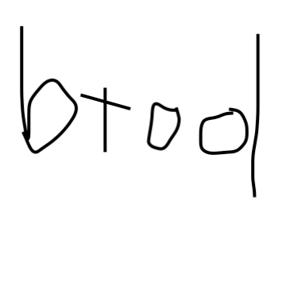

# btool

The simplest C/C++ build tool.

[](https://circleci.com/gh/ankeesler/btool/tree/master)



## To try out `btool`...

```
$ docker run -it ankeesler/btool
$ btool -root BasicC -target main
...
$ ./BasicC/main
hey!
$ cat README.md # for more information about the examples
```

## To install the latest `btool` build...

```
$ ./script/install-btool.sh latest
```

## To install a local `btool` build...

```
$ ./script/install-btool.sh local
```

## To run the tests...

```
$ ./script/test.sh
```

## Guiding Principles

- Ease of use
- Speed
- Extensibility
